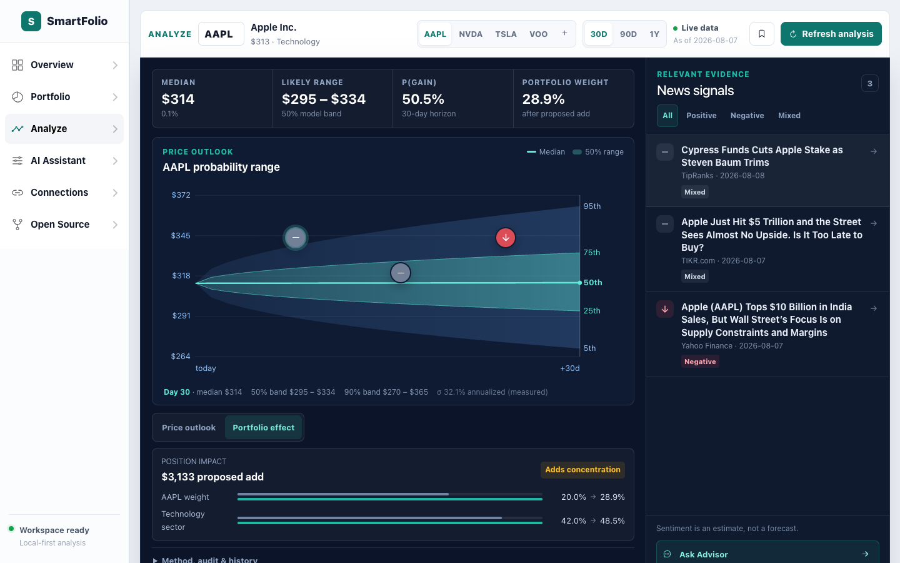

# SmartFolio

AI investment intelligence platform: guided investor onboarding, live portfolio
diagnostics, an OpenVC-style stock analysis terminal, scenario modeling, and an
AI advisor — built on a strict rule: **deterministic code calculates every
number; AI only explains.**

[**Live demo**](https://smartfolio-lemon.vercel.app) · [API docs](https://smartfolio-api-yjcj.onrender.com/docs) · [API health](https://smartfolio-api-yjcj.onrender.com/health)



## What It Does

SmartFolio lets an investor import or edit holdings, inspect deterministic risk and performance metrics, run stock forecasts and backtests, model portfolio scenarios, and ask an AI advisor grounded in the current portfolio state.

## Tech Stack

| Layer | Technologies |
| --- | --- |
| Frontend | React 18, TypeScript, Vite, Zustand, Ionic web components |
| API and analytics | Python 3.12, FastAPI, Pydantic v2, SQLAlchemy, deterministic portfolio and risk engines |
| AI workflow | Seven-stage agent pipeline, OpenAI/Anthropic routing and failover, compliance guardrails |
| Data | Neon Postgres, SQLite fallback, Finnhub, Alpha Vantage |
| Delivery and quality | Vercel, Render, Docker, Sentry, Pytest, Vitest, GitHub Actions |

## Architecture

```
Vercel (React 18 + TypeScript + Vite + Zustand)
  │  REST/JSON, gzip
  ▼
Render (FastAPI + Pydantic v2 — rate limited, request-id structured logs)
  │
  ├─ Agent pipeline (orchestrator.py — every step emits a timed AgentEvent):
  │    Ticker Intake → Market Data Tool → Stock Forecast → Backtest
  │    → Portfolio (what-if) → Memo Writer (LLM) → Compliance (guardrail)
  │
  ├─ Market data: Finnhub / Alpha Vantage, TTL cache + per-symbol
  │    fetch coalescing, offline reference backstop
  ├─ LLM routing: OpenAI ↔ Anthropic with automatic failover,
  │    deterministic template as the final fallback
  └─ Neon Postgres (asyncpg, pre-ping pooling) — anonymous workspaces,
       persisted analysis history, memos
```

The frontend also ships a complete **local mirror** of the deterministic
engine — the demo keeps working with the backend offline, and the UI shows
which engine answered (`API` vs `Local`, LLM vs template narration).

## The compliance stance

Educational analysis only, enforced in code: the LLM receives deterministic
results as read-only JSON and its output is validated by a Compliance agent
(rules against guarantees and buy/sell language). Non-compliant narration is
rejected and replaced with the deterministic template; the disclaimer is
appended server-side, never left to the model.

## Features

- **Portfolio workspace** — editable holdings with live-recalculating metric
  cards, an asset-class donut, position-weight bars, and a deterministic Risk
  Lab with volatility, beta, VaR/CVaR, risk contribution, and stress replays
- **Performance foundation** — CSV import for holdings, dated transactions,
  and account valuations; a persisted activity ledger; cash-flow-adjusted
  time-weighted return; drawdown; and like-for-like benchmark comparison
- **Analyze Stock terminal** — forecast bands, backtest, a real agent audit
  trail with per-step timings, saved memos, and replayable run **history**
  (persisted server-side per anonymous workspace)
- **AI Assistant** — contribution / return / rebalance controls driving a
  10-year projection, a 2,000-path seeded Monte Carlo goal simulator, fair
  strategy comparisons, a confidence-based contribution optimizer, locally
  saved plan snapshots, scenario-aware chat, and live portfolio-risk context
- **AI advisor** — answers grounded in a fresh deterministic analysis of the
  exact state you send, including the risk budget and top risk contributors;
  works keylessly via templates
- **Open Source screen** — the real agent graph and pipeline, matching the
  trace the backend emits

## Running locally

```bash
# Backend (Python 3.12+)
git clone https://github.com/adiarora06/smartfolio.git
cd smartfolio/backend
python3 -m venv .venv
source .venv/bin/activate
pip install -r requirements.txt
uvicorn app.main:app --reload --port 8000

# Frontend (Node 22+, separate terminal)
cd smartfolio/frontend
npm ci
npm run dev                # http://localhost:5173, auto-detects the backend
```

Everything degrades gracefully with zero keys: offline reference prices,
template narration, SQLite persistence.

## Configuration

| Env var | Effect (all optional) |
|---|---|
| `MARKET_DATA_API_KEY` + `MARKET_DATA_PROVIDER` | Live quotes (finnhub / alphavantage) |
| `OPENAI_API_KEY` / `ANTHROPIC_API_KEY` | LLM narration; both set → automatic failover |
| `LLM_PROVIDER`, `LLM_MODEL` | Primary provider and model |
| `DATABASE_URL` | Neon/Postgres (raw Neon URL accepted); default SQLite |
| `SMARTFOLIO_CORS_ORIGINS` | Allowed browser origins |
| `SENTRY_DSN` | Error tracking |

## Tests & CI

- `backend/tests` — pytest contracts across the full API and financial engine
- `frontend/src/**/__tests__` — Vitest coverage for browser behavior and fallbacks
- GitHub Actions runs both suites + the frontend build on every push/PR; a
  keep-warm cron pings the free-tier backend every 10 minutes

## Docs

- [SCALING_PLAN.md](SCALING_PLAN.md) — phased path to production scale
- [RENDER_DEPLOYMENT.md](RENDER_DEPLOYMENT.md) / [DEPLOYMENT_PIPELINE.md](DEPLOYMENT_PIPELINE.md) — deploy runbooks
- [OPENAI_SETUP.md](OPENAI_SETUP.md) — LLM provider setup
- `SmartFolio-Vault/` — Obsidian vault: architecture notes, agent system,
  data model, decisions

## Disclaimer

Educational prototype. Not financial advice.
